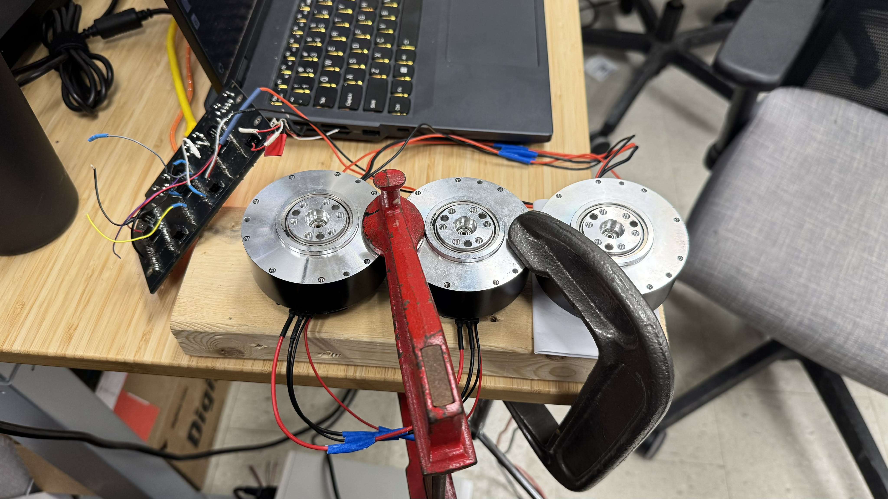

# RobStride Teensy CAN controller

Teensy 4.1 firmware for a **RobStride RS06** actuator over **CAN** (FlexCAN_T4, extended IDs). Control and diagnostics use a **USB Serial** command line (no Ethernet / no PC bridge in this workflow).

<p align="center">
  
</p>

## What to open in the Arduino IDE

Open the sketch folder:

| Path | Contents |
|------|-----------|
| **`Robstride_Controller/`** | `Robstride_Controller.ino` + `RobStrideMotor.cpp` / `RobStrideMotor.h` |

1. Install **Teensyduino** (or your Teensy board package) and the **FlexCAN_T4** library.  
2. Select your Teensy board (e.g. Teensy 4.1) and the correct USB/COM port.  
3. Edit **`USER CONFIG`** at the top of `Robstride_Controller.ino` if needed. The current sketch is configured for one motor: CAN id `1`, model `RS06`.
4. Upload, open Serial Monitor at **115200**, type **`help`** for the full command list.

Typical bring-up:

```text
reset
enable 1
stream 1 100
nudge 1 0.2 10 1
jog 1 0.2
jog 1 0
stop 1
```

The active controller uses RobStride private **Type-1 operation-control** frames for motion. The old RAM-mode commands (`pos`, `vel`, `cur`, `mode`, `all`, `sync`) are intentionally not part of this workflow. Use `move`, `nudge`, `jog`, `torque`, or raw `motion` instead.

## Hardware

- Teensy 4.1 (or as supported by your board selection) on CAN1 (see sketch: `FlexCAN_T4<CAN1, …>`).  
- One RobStride drive on the CAN bus; its ID must match **`MOTOR_IDS[]`** in the sketch.

## Legacy (not required for this project)

Older **Spine board** material (Ethernet ↔ UDP ↔ CAN bridge, CMake PC apps, and Teensy examples **E01–E06**) is kept under **`legacy/`** for reference only. See **`legacy/README.md`** if you need that stack.
